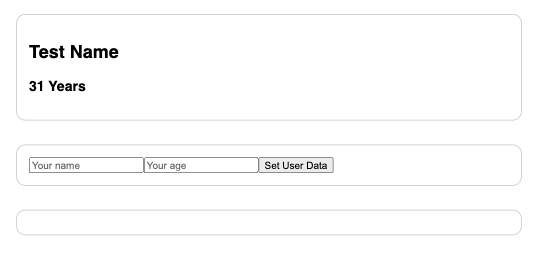

# Practice/ Template Vue Components

Practice template for vue components. Udemy course by Maximilian Schwarzmüller. 

## Description

* See user details
* Update user details

A simple exercise/ template learning to use and pass data across components. 

## Instructions

``npm i``

``npm run serve``

## Screenshots

